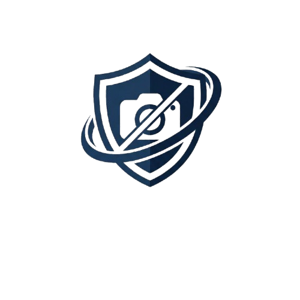

<p align="center">
  
</p>

<h1 align="center">Screenshot Guard</h1>

<p align="center">
  <strong>🔐 Secret Scanner with OCR Superpowers</strong>
</p>

<p align="center">
  <em>The first secret scanner that finds secrets in code AND screenshots.</em>
  <br>
  <a href="https://github.com/Keyvanhardani/german-ocr"></a>
   <br>
  <sub>Powered by <a href="https://github.com/Keyvanhardani/german-ocr">german-ocr</a></sub>
</p>

<p align="center">
  <a href="https://pypi.org/project/screenshot-guard/"></a>
  <a href="https://www.npmjs.com/package/screenshot-guard"></a>
  <a href="https://packagist.org/packages/keyvan/screenshot-guard"></a>
  <a href="https://opensource.org/licenses/Apache-2.0"></a>
</p>

<p align="center">
  <a href="https://github.com/Keyvanhardani/german-ocr"></a>
  
  
</p>

---

## 🚨 The Problem

Developers take screenshots. Screenshots of terminals, dashboards, documentation.

And sometimes those screenshots contain secrets:

| 😱 Scenario | 💸 Impact |
|-------------|-----------|
| AWS keys in terminal output | $47,000 cloud bill |
| API tokens in dashboard screenshots | Data breach |
| "Example" credentials that are actually real | Account compromise |

**Regular secret scanners miss all of this.**

---

## 💡 The Solution

Screenshot Guard scans your code **AND** your images using OCR.

```bash
# Install
pip install screenshot-guard[ocr]

# Scan
screenshot-guard scan ./your-project
```

<p align="center">
  
  
  
  
  
  
</p>

---

## ✨ Features

| Feature | Description |
|---------|-------------|
| 🔍 **OCR-powered** | Finds secrets in PNG, JPG, GIF, BMP, WebP images |
| 🎯 **50+ patterns** | AWS, Azure, GCP, GitHub, Stripe, Slack, and more |
| 🏠 **Local processing** | No cloud, no data leaves your machine |
| 🤖 **GitHub Action** | Easy CI/CD integration with SARIF support |
| 🪝 **Pre-commit hook** | Catch secrets before they're committed |

---

## 📦 Installation

<table>
<tr>
<td>

### 🐍 Python
```bash
pip install screenshot-guard[ocr]
```

</td>
<td>

### 📦 Node.js
```bash
npm install screenshot-guard
```

</td>
<td>

### 🐘 PHP
```bash
composer require keyvan/screenshot-guard
```

</td>
</tr>
</table>

### Python Installation Options

| Command | What's installed |
|---------|------------------|
| `pip install screenshot-guard` | Text scanning only (no OCR) |
| `pip install screenshot-guard[ocr]` | + [german-ocr](https://github.com/Keyvanhardani/german-ocr) with llama.cpp |
| `pip install screenshot-guard[ollama]` | + german-ocr with Ollama backend |

> 💡 **Note:** You don't need to install german-ocr separately - it comes automatically with `[ocr]`!

---

## ⚡ Quick Start

### 💻 CLI Usage

```bash
# Scan current directory
screenshot-guard scan .

# Scan with JSON output
screenshot-guard scan ./src --format json --output report.json

# Only critical and high severity
screenshot-guard scan . --severity high

# Disable OCR (faster, but misses images)
screenshot-guard scan . --no-ocr

# Use Ollama backend for OCR
screenshot-guard scan . --backend ollama
```

### 🤖 GitHub Action

```yaml
name: Security Scan

on: [push, pull_request]

jobs:
  secrets:
    runs-on: ubuntu-latest
    steps:
      - uses: actions/checkout@v4

      - name: Scan for secrets
        uses: Keyvanhardani/screenshot-guard@v1
        with:
          path: '.'
          severity: 'medium'
          ocr: 'true'
          fail-on-findings: 'true'
```

### 🪝 Pre-commit Hook

```yaml
# .pre-commit-config.yaml
repos:
  - repo: https://github.com/Keyvanhardani/screenshot-guard
    rev: v0.1.0
    hooks:
      - id: screenshot-guard
        args: ['--severity', 'high', '--no-ocr']
```

---

## 🎯 Supported Patterns

| Provider | Patterns | Examples |
|----------|:--------:|----------|
|  | 5 | Access Keys, Secret Keys, Session Tokens |
|  | 5 | Storage Keys, Connection Strings, SAS Tokens |
|  | 5 | API Keys, Service Accounts, OAuth Secrets |
|  | 6 | PATs, OAuth Tokens, App Private Keys |
|  | 2 | Bot Tokens, Webhooks |
|  | 2 | Secret Keys, Restricted Keys |
| 🔐 Generic | 15+ | Passwords, Private Keys, JWTs, Database URLs |

```bash
# List all patterns
screenshot-guard patterns
```

---

## 📊 Output Formats

### Table (default)
```
┌──────────────────┬──────┬────────────────────┬──────────┬────────┐
│ File             │ Line │ Type               │ Severity │ Source │
├──────────────────┼──────┼────────────────────┼──────────┼────────┤
│ screenshot.png   │ 3    │ AWS Access Key ID  │ CRITICAL │ OCR    │
│ config.yaml      │ 12   │ Database URL       │ CRITICAL │ Text   │
└──────────────────┴──────┴────────────────────┴──────────┴────────┘
```

### Export Options

| Format | Command | Use Case |
|--------|---------|----------|
| 📋 JSON | `--format json` | CI/CD pipelines |
| 🔒 SARIF | `--format sarif` | GitHub Security |
| 📝 Markdown | `--format markdown` | Documentation |

---

## 🔧 OCR Backends

<p align="center">
  <a href="https://github.com/ggerganov/llama.cpp">
    
  </a>
  <a href="https://ollama.com">
    
  </a>
  <a href="https://german-ocr.de">
    
  </a>
</p>

| Backend | Speed | Setup | GPU |
|---------|-------|-------|-----|
| `llamacpp` | ⚡ Fast | `pip install screenshot-guard[ocr]` | Optional |
| `ollama` | ⚡ Fast | Requires Ollama | Optional |
| `cloud` | ⚡⚡ Fastest | API key required | N/A |

```bash
# Use specific backend
screenshot-guard scan . --backend llamacpp
screenshot-guard scan . --backend ollama
```

---

## 🔌 API Usage

<details>
<summary><b>🐍 Python</b></summary>

```python
from screenshot_guard import Scanner, SecretDetector, OCREngine

# Initialize
detector = SecretDetector(min_severity="high")
ocr = OCREngine(backend="llamacpp")
scanner = Scanner(detector=detector, ocr_engine=ocr)

# Scan
findings = scanner.scan("./your-project")

for finding in findings:
    print(f"{finding.file_path}:{finding.line_number} - {finding.pattern_name}")
    print(f"  Severity: {finding.severity}")
    print(f"  From OCR: {finding.from_ocr}")
```

</details>

<details>
<summary><b>📦 Node.js</b></summary>

```javascript
const { scan } = require('screenshot-guard');

// Scan a directory
const findings = await scan({
  path: './your-project',
  severity: 'high',
  ocr: true
});

findings.forEach(finding => {
  console.log(`${finding.file}:${finding.line} - ${finding.type}`);
  console.log(`  Severity: ${finding.severity}`);
});
```

</details>

<details>
<summary><b>🐘 PHP</b></summary>

```php
use ScreenshotGuard\Client;

$guard = new Client();
$findings = $guard->scan('./your-project', [
    'severity' => 'high'
]);

foreach ($findings as $finding) {
    echo "{$finding['file_path']}:{$finding['line_number']} - {$finding['pattern_name']}\n";
}
```

</details>

---

## 🙈 Ignoring Files

Create `.screenshotguardignore` in your project root:

```gitignore
# Ignore test fixtures
tests/fixtures/*

# Ignore vendor
vendor/

# Ignore specific files
docs/example-config.yaml
```

---

## 😱 Why OCR?

Real examples where OCR would have helped:

| Incident | Secret Exposed | Cost |
|----------|---------------|------|
| 📸 Terminal screenshot in docs | AWS Access Key | **$47,000** cloud bill |
| 📊 Dashboard screenshot in README | "Example" API key (was real) | 2 months exposed |
| 💬 Slack screenshot in GitHub issue | GitHub token | Repository compromised |

---

## 🤝 Contributing

Contributions are welcome! Please see [CONTRIBUTING.md](CONTRIBUTING.md).

---

## 📄 License

Apache 2.0 - see [LICENSE](LICENSE)

---

## 👤 Author

**Keyvan Hardani**

<p>
  <a href="https://keyvan.ai"></a>
  <a href="https://github.com/Keyvanhardani"></a>
  <a href="https://huggingface.co/Keyven"></a>
</p>

---

<p align="center">
  Made with ❤️ for security
</p>

<p align="center">
  <a href="https://github.com/Keyvanhardani/screenshot-guard">⭐ Star us on GitHub!</a>
</p>
